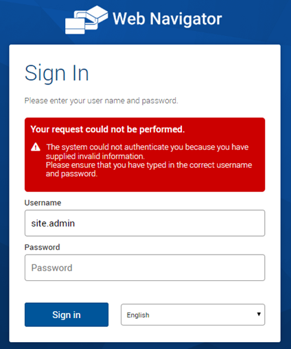
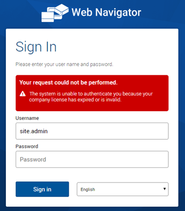

# Log On

The default mechanism for authentication in the Web Navigator is Forms Authentication. This authentication mechanism requires a username and password to log on to the Web Navigator. Once authenticated, the site’s home page will be shown. The site dashboard is displayed on the home page.

<iframe width="420" height="315" src="https://www.youtube.com/embed/dvZlEqZ6ATQ" frameborder="0" allow="autoplay; encrypted-media" allowfullscreen></iframe>

In this video we Log On to the Web Navigator.

## Steps

1. Launch a web browser and navigate to the Web Navigator login page.
2. Enter User Credentials
   1. Enter your Username in the "User Name" field.
   2. Enter your Password in the "Password" field.
3. Select Language (if applicable)
   1. Choose English or another preferred language from the dropdown menu.
4. Click on the "Log On" button.
   1. Upon successful authentication, the home page of the Web Navigator is displayed.

## Invalid Credentials

<audio controls>
<source src="https://info.flowcentric.com/hubfs/AI-Generated%20Media/invalid%20credentials_VOO.m4a" type="audio/mp4">
  Your browser does not support the audio element.
</audio>

If invalid credentials are provided you will be presented with an error message stating this fact and be prompted to try again.

### License Expiry

<audio controls>
<source src="https://info.flowcentric.com/hubfs/AI-Generated%20Media/sites%20licence%20has%20expired_VOO.m4a" type="audio/mp4">
  Your browser does not support the audio element.
</audio>

If the site's licence has expired, users won’t be able to sign into the Web Navigator and will require a system administrator to update the product license key before continuing.

