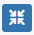

# Pending Tasks

The Pending Tasks page is central to streamlining your processes. It provides an organised, real-time overview of all tasks that require your attention, including those waiting for review, approval, or action.

By consolidating all your pending responsibilities in one place, it ensures that nothing is overlooked, making it easier to stay on top of your workload and meet deadlines.

## Information Icons

<audio controls>
<source src="https://info.flowcentric.com/hubfs/AI-Generated%20Media/Pending_InformationalIcons_VOO.m4a">
  Your browser does not support the audio element.
</audio>

| Icon | Name | Purpose |
| ---- | ---- | ---- |
|  | Copy ticket details | Provides technical task details for logging support tickets with the provider. |
|  | Collapse | Collapses the task, hiding metadata. |
|  | Expand | Expands the task, displaying metadata. |
|  | Participant | Represents a Participant or Participant Group (e.g., Finance Department or specific roles like CFO). |
|  | Overdue | Indicates that the task instance is overdue. |
|  | Assigned | Signifies that the task has been assigned to a specific user. |
|  | Due Today | Indicates that the task instance is due today. |
|  | Routed | Indicates the task has been Routed from another participant / user. |
|  | Escalated | Indicates the task has been escalated from another participant or user. |
