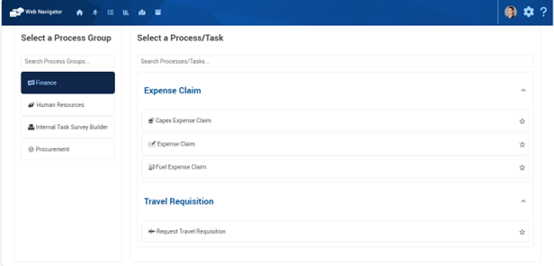

# Task Management

## Start

The **Start** a Process option allows you to initiate processes with ease and confidence.

Supported by a robust Security Framework, the system ensures that each logged-on System User only sees information and options relevant to their role and authorisation level. This secure setup empowers you to act within your designated scope. You can work efficiently, assured that you’re only authorising actions within your authority level.

When you explore the modern Start mode, you will have an overview of the overall process steps.

<iframe width="420" height="315" src="https://www.youtube.com/embed/*UpdateThis*" frameborder="0" allow="autoplay; encrypted-media" allowfullscreen></iframe>

In this animation we Log On to the Web Navigator.

### Steps

1. To start a process, navigate to the Start a Process site area using the site Main Menu.
2. Select the desired process to start.
