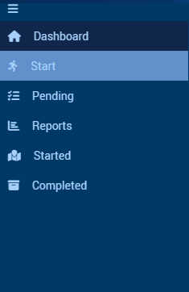

# Navigation and Interface

## Main Menu

The Main Menu in the Processware Web Navigator can be customised via the Personalisation Wizard and or the Settings menu. It can be displayed either at the top of the landing page or on the left side, based on user preference.

### Left Menu Option

### Top Menu Option

## Menu Options

- **Dashboard**: The site’s home page.

- **Start**: Navigates the logged in user to the process start area where the user can initiate a process.

- **Pending**: Navigates the logged in user to the awaiting task list.

- **Reports**: Navigates the logged in user to the reporting area.

- **Progress**: To be added

- **Started**: Navigates the logged in user to the open process and task tracking area.

- **Completed**: Navigates the logged in user to the completed process and task archive area.

These options provide streamlined navigation to key functionalities, enhancing user efficiency.

## Dashboard

The Dashboard is the central hub for accessing essential processes and tasks within the Web Navigator. It enhances workflow efficiency by presenting key information in a single, easily accessible location.

> [!NOTE]
> The layout of the Dashboard can be customised by adding, removing, or rearranging widgets.

> [!NOTE]
> This flexibility allows users to tailor the workspace to their specific requirements, ensuring a personalised and efficient experience. Customisations are saved for future use.

### Available Dashboard Widgets

The Web Navigator Dashboard offers a variety of widgets to customise your workspace. These widgets provide quick access to key information and tools:

- **Favourite Tasks**: Displays tasks marked as favourites for easy access.

- **Tasks at a Glance**: Shows the number of pending tasks assigned to the logged-in user, grouped by their status (overdue, due, or pending).

- **Most Used Tasks**: Highlights the tasks you use most frequently.

- **Calendar**: Displays tasks based on their due dates. Clicking on a highlighted date navigates to the corresponding overdue tasks.

- **Report**: Allows users to add static or configurable reports to the widget panel. Users can select reports, configure parameters, and manage widgets directly from the dashboard.

- **Quick Actions**: Provides shortcuts to frequently used actions for improved efficiency.
